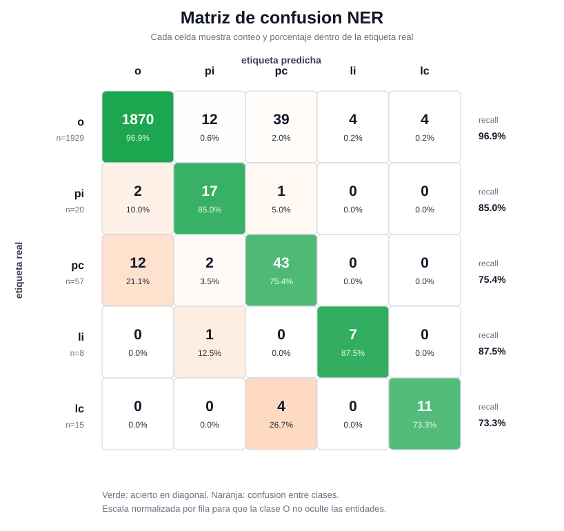
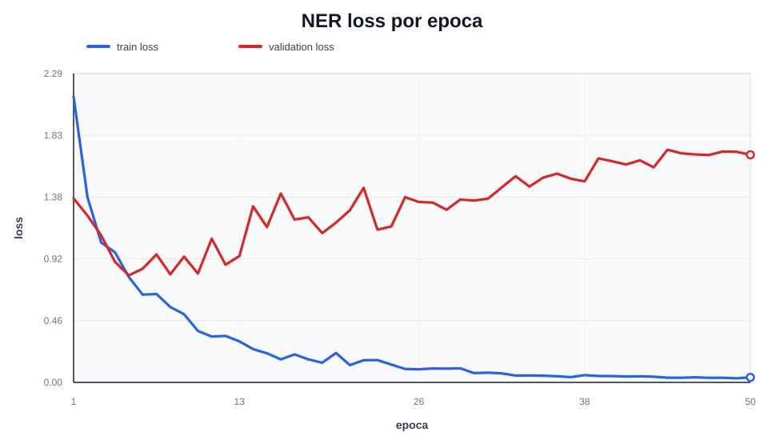
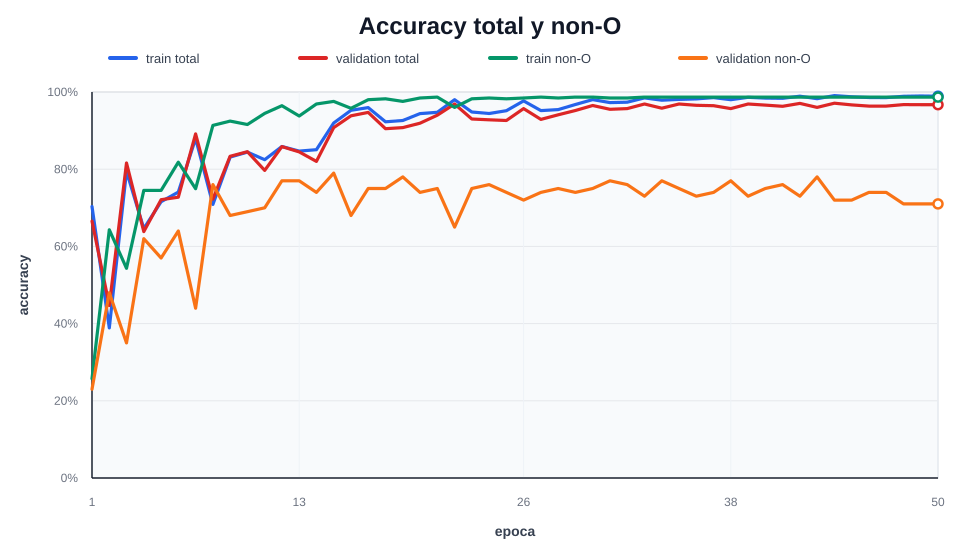
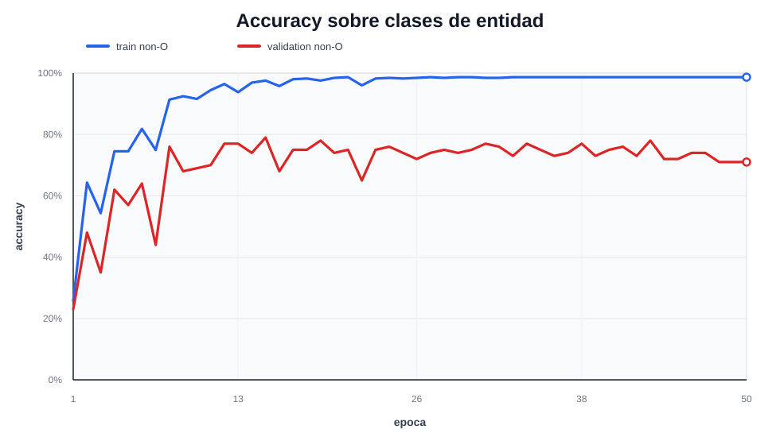

# Practica 5 — Transformer desde cero para LM y NER

Implementacion desde cero de un Transformer para modelado de lenguaje y
reconocimiento de entidades nombradas (NER) sobre corpus de literatura inglesa
clasica (Alice in Wonderland, Jane Eyre, Pride and Prejudice, etc.).

## Integrantes

- Diego Alonso Arceiz
- Carlos Mantilla Mateos

## Estructura del repositorio

```
practica_5/
├── README.md                        # Este archivo
├── pyproject.toml                   # Configuracion del proyecto (uv)
├── tokenizer.json                   # Tokenizador BPE (500 vocablos)
├── p5_causal_2604.pth               # Checkpoint LM preentrenado
├── p5_ner_2604.pth                  # Checkpoint NER final
├── informe_2604.html                # Informe de hiperparametros y resultados
├── src/
│   ├── main.py                      # CLI con comandos de train e inferencia
│   ├── transformer.py               # Arquitectura Transformer base
│   ├── causalLLM.py                 # Modelo causal para LM
│   ├── ner.py                       # Modelo NERLLM para extraccion de entidades
│   ├── tokenizer.py                 # Tokenizador BPE propio
│   ├── train.py                     # Bucles de entrenamiento
│   └── attention.py                 # Modulos de atencion y RoPE
├── corpus_pretrain/                 # Corpus de 7 libros para preentrenamiento
│   ├── alice_in_wonderland.txt
│   ├── looking_glass.txt
│   ├── treasure_island.txt
│   ├── pride_and_prejudice.txt
│   ├── oliver_twist.txt
│   ├── great_expectations.txt
│   └── jane_eyre.txt
├── pre-entrega_2601/                # Dataset NER etiquetado
│   ├── merged.json                  # Corpus anotado BIO
│   ├── corpus_original/             # Textos originales
│   └── etiquetados/                 # Anotaciones por fichero
└── experiments/                     # Artefactos de experimentacion
    ├── lm_exp2/
    │   └── history.json             # Historial del LM preentrenado
    ├── grid_ner/                    # Resultados del grid search NER
    │   ├── results.json             # Metricas de los 48 runs
    │   ├── best_result.json         # Mejores hiperparametros encontrados
    │   ├── best_ner.pth             # Mejor checkpoint del grid search
    │   └── best_ner_metrics/        # Metricas del mejor modelo del grid
    └── ner_final/
        ├── history.json             # Historial del entrenamiento NER final
        └── metrics/                 # Graficos y metricas del modelo final
```

## Indice

1. [Arquitectura del modelo](#arquitectura-del-modelo)
2. [Corpus de preentrenamiento](#corpus-de-preentrenamiento)
3. [Mejoras de entrenamiento del LM](#mejoras-de-entrenamiento-del-lm)
4. [Preentrenamiento del modelo de lenguaje](#preentrenamiento-del-modelo-de-lenguaje)
5. [Datos NER](#datos-ner)
6. [Arquitectura NER](#arquitectura-ner)
7. [Fase 1 — Experimentacion inicial NER](#fase-1--experimentacion-inicial-ner)
8. [Fase 2 — Grid search NER](#fase-2--grid-search-ner)
9. [Fase 3 — Entrenamiento final](#fase-3--entrenamiento-final)
10. [Comandos de uso](#comandos-de-uso)
11. [Conclusiones](#conclusiones)

---

## Arquitectura del modelo

### Tokenizador BPE

Se entrena un tokenizador Byte-Pair Encoding (BPE) propio sobre el corpus de
preentrenamiento. El vocabulario tiene 500 tokens, suficiente para capturar
morfologia inglesa sin fragmentar palabras frecuentes.

### Transformer backbone

La arquitectura base se implementa desde cero en `src/transformer.py`. Cada
bloque incluye:

- Auto-atencion multi-cabezal con mascaras causales opcionales
- Red feed-forward con activacion GELU y factor de expansion 4×
- LayerNorm pre-atencion y pre-FFN (pre-norm)
- Dropout en atencion y feed-forward

Parametros fijos del backbone:

| parametro | valor |
| --- | ---: |
| `vocab_size` | 500 |
| `d_model` | 128 |
| `n_heads` | 4 |
| `n_layers` | 4 |
| `expansion` | 4 |
| `context_size` | 128 |

### Rotary Position Embeddings (RoPE)

El mecanismo de posicion original usaba embeddings aprendidos que se sumaban a
los token embeddings. Se reemplazo por **RoPE** (Rotary Position Embeddings):

- Las frecuencias de rotacion se calculan como `θ_i = 1 / 10000^(2i / head_dim)`, igual que en el paper original.
- Los tensores `cos` y `sin` se precomputan hasta `max_seq_len` y se registran como buffers (se mueven automaticamente a GPU).
- La rotacion se aplica sobre queries y keys dentro de cada cabeza de atencion **antes** del producto escalar, sin modificar los values.
- La tabla de embeddings de posicion (`pos_emb`) se elimino completamente de `Transformer`.

Ventajas respecto a embeddings aprendidos: la posicion relativa entre tokens
queda codificada en el angulo de rotacion, lo que mejora la generalizacion a
longitudes no vistas durante el entrenamiento.

### CausalLLM

`CausalLLM` extiende `Transformer` con una cabeza lineal `lm_head` que proyecta
los hidden states al vocabulario para predecir el siguiente token. Usa **weight
tying**: los pesos de `lm_head` son los mismos que los del embedding de entrada,
lo que reduce parametros y regulariza el modelo.

Durante el preentrenamiento la atencion es siempre causal (`causal=True`): cada
posicion solo atiende a las anteriores.

---

## Corpus de preentrenamiento

El corpus original constaba de dos libros de Lewis Carroll (~319 KB). Se amplio
con cinco novelas clasicas adicionales del Proyecto Gutenberg para aumentar la
diversidad lexica y la exposicion a nombres propios:

| fichero | tamano |
| --- | ---: |
| `alice_in_wonderland.txt` | 150 KB |
| `looking_glass.txt` | 169 KB |
| `treasure_island.txt` | 380 KB |
| `pride_and_prejudice.txt` | 738 KB |
| `oliver_twist.txt` | 917 KB |
| `great_expectations.txt` | 1038 KB |
| `jane_eyre.txt` | 1044 KB |
| **total** | **~4.4 MB** |

Todos los ficheros se almacenan en `corpus_pretrain/` y se concatenan en el
momento del entrenamiento.

---

## Mejoras de entrenamiento del LM

Se introdujeron tres mejoras sobre el bucle de entrenamiento original:

### Scheduler con warmup y cosine decay

Se implemento un `LambdaLR` con dos fases:

1. **Warmup lineal**: los primeros `warmup_steps` pasos escalan el LR de 0 al
   valor pico.
2. **Cosine decay**: desde `warmup_steps` hasta el final del entrenamiento el LR
   decae suavemente hasta un minimo de `min_lr_ratio * lr` (10 % del pico por
   defecto). Usar un suelo distinto de cero evita que el modelo deje de aprender
   en las epocas finales.

El scheduler hace un paso despues de cada batch de optimizacion (no una vez por
epoca), lo que da una curva de LR continua.

### Weight decay

Se usa AdamW con `weight_decay=0.1` para todos los parametros de peso (no bias
ni LayerNorm). Actua como regularizacion L2 y reduce el sobreajuste en corpus
pequenos.

### Early stopping

Se guarda internamente el estado del modelo en la epoca con mejor metrica de
seleccion. Al final del entrenamiento se restaura ese checkpoint. Esto evita que
el modelo se quede con el estado sobreajustado de la ultima epoca.

---

## Preentrenamiento del modelo de lenguaje

Se realizaron dos experimentos de LM. Solo el segundo checkpoint esta incluido
en el repositorio:

| experimento | corpus | RoPE | scheduler | notas |
| --- | --- | --- | --- | --- |
| LM exp1 | 2 libros originales | no | no | pesos no incluidos |
| **LM exp2** | 7 libros (~4.4 MB) | **si** | **si** | `p5_causal_2604.pth` |

El LM exp2 (`p5_causal_2604.pth`) es el punto de partida para todos
los experimentos NER. Se entreno con:

```bash
uv run fdi-pln-2604-p5 train tokenizer corpus_pretrain \
  --vocab-size 500 --out tokenizer.json

uv run fdi-pln-2604-p5 train lm corpus_pretrain \
  --tokenizer tokenizer.json --out p5_causal_2604.pth \
  --context-size 128 --epochs 15 --batch-size 64 --lr 0.0003 \
  --d-model 128 --n-layers 4 --n-heads 4 \
  --expansion 4 --dropout 0.2 \
  --warmup-steps 100 --weight-decay 0.1
```

El historial incluido en `experiments/lm_exp2/history.json` registra 15
epocas. El mejor checkpoint fue la epoca 15, con `train_loss=2.6794` y
`val_loss=3.0874`; ese estado es el que se entrega como `p5_causal_2604.pth`.

### Impacto de las mejoras en la generacion

La introduccion de RoPE, scheduler con warmup/decay y expansion del corpus de 2 a
7 libros produjo una mejora cualitativamente notable en la coherencia del texto
generado. A continuacion se muestra la misma frase generada antes y despues de
las mejoras, ambas con temperatura 1.0 y 150 tokens.

**Baseline** (sin RoPE, sin scheduler, corpus de 2 libros):

> alice look around and see the rest trees of member on say, some a hard—and
> most course went on," said the dodo. the thing was she got to from her knew
> poor lessons sort of all over she along more little scare; but the hatter of
> feet being dormouse being all her footman ready very nearly, and the foot,
> '' for not a moment thing itself feet, rule of d any glass the wood-and-butter,"
> the king said, "but lowers when you've went on, "i don't know

**Final** (con RoPE, scheduler, corpus de 7 libros):

> Alice looked around; and, in which I uttered that every family reflected in my
> own waiter to reach the door, the time of the verses took from the ball, left
> the pipe upon my hands. I tried to be stopped. I having left the effort.
>
> Something more, and said, I had asked him that I would consider him, that he
> should condescend to the bedside; but Wickham, with a look on his head, and
> looked at it again. "She is a thousand pounds," he said. "St. John came to her
> with me. At the next day; but he is sad. But he cannot

**Mejoras observadas:**

- **Coherencia morfosintactica**: el baseline contiene fragmentos incoherentes
  ("rest trees of member", "rule of d any glass", "but lowers when you've").
  El modelo final mantiene mejor estructura oracional.
- **Vocabulario**: el baseline omite tildacion y puntuacion; el final usa comillas,
  puntos y nombres literarios correctos ("Wickham", "St. John").
- **Contexto a largo plazo**: el baseline repite patrones sin sentido semantico.
  El final construye frases con cierta logica narrativa, aunque imperfecta.
- **Influencia del corpus**: ampliando de Alice/Looking-Glass (2 libros) a obras
  de Austen, Dickens y Charlotte Bronte (7 libros) el modelo aprende patrones de
  prosa mas ricos y variados.

El texto sigue siendo imperfecto (ej. "in my own waiter" no tiene sentido), pero
la mejora es sustancial. Esto ilustra por que cada una de las tres mejoras
(RoPE, scheduler, corpus ampliado) fue importante.

### Ejemplos de generacion de texto

Generacion con temperatura 1.0 y 150 tokens a partir de distintos prompts:

**Prompt:** `The Queen said`

> The Queen said, "Well, a small time. Never mind's pride, Bill, to tell me
> that I would have to rob it up to me?" These says that I was rather rather
> under state of curiosity in the house, whose accidental injury was to
> irritate her, and the pathy of tears.

**Prompt:** `It was a very curious`

> It was a very curiously distincted to anything of his own, in every
> companion, which was called over him to more than either his mother's already
> set, or offered him of speedily as he was in his manner to except the
> existence of his own expression of vain the course of his affection of those
> infamous character.

El vocabulario esta dominado por las novelas del corpus (en particular por Jane
Eyre y Oliver Twist), lo que explica que un prompt de Alice derive rapidamente
hacia referencias como "Thornfield" o "Oliver".

---

## Datos NER

El corpus anotado se carga desde `pre-entrega_2601/merged.json`. Contiene
frases de Alice in Wonderland y Through the Looking-Glass con etiquetas BIO a
nivel de palabra:

| etiqueta | significado |
| --- | --- |
| `o` | no-entidad |
| `pi` | B-PER (inicio de persona) |
| `pc` | I-PER (continuacion de persona) |
| `li` | B-LOC (inicio de lugar) |
| `lc` | I-LOC (continuacion de lugar) |

### Alineamiento BPE

Como el tokenizador BPE puede fragmentar una palabra en varios sub-tokens, se
aplica `align_to_bpe()`: los sub-tokens del primer fragmento heredan la etiqueta
B-X, y los fragmentos de continuacion reciben la etiqueta I-X
correspondiente.

### Split estratificado por frases

El split se realiza a nivel de frase completa (no a nivel de sub-token), lo que
garantiza que ningun par (contexto, etiqueta) de la misma frase quede partido
entre train y validacion. Las frases se ordenan por densidad de entidades para
que el split 85/15 conserve la proporcion de etiquetas.

El split del modelo final:

| split | frases | chunks BPE | `o` | `pi` | `pc` | `li` | `lc` |
| --- | ---: | ---: | ---: | ---: | ---: | ---: | ---: |
| train | 57 | 93 | 8104 | 99 | 270 | 24 | 58 |
| validacion | 11 | 23 | 1929 | 20 | 57 | 8 | 15 |

---

## Arquitectura NER

`NERLLM` extiende `Transformer` con una cabeza lineal por token que proyecta
cada hidden state a las 5 etiquetas. La atencion es **bidireccional**
(`causal=False`): cada token puede atender a toda la frase, lo que es apropiado
para NER a diferencia de la generacion causal.

Los pesos del backbone se inicializan desde el checkpoint del LM preentrenado
(transferencia de aprendizaje). Solo la cabeza NER se inicializa aleatoriamente.

### Pesos de loss por clase

La clase `o` domina el dataset (>95% de los tokens). Si se usa cross-entropy sin
ponderacion, el modelo aprende rapidamente a predecir casi todo como `o` y
consigue alta accuracy sin detectar ninguna entidad.

Se introduce una loss con pesos por clase:

```
o   → 1.0
pi  → entity_loss_weight
pc  → entity_loss_weight × continuation_weight_multiplier
li  → entity_loss_weight × location_weight_multiplier
lc  → entity_loss_weight × location_weight_multiplier × continuation_weight_multiplier
```

El parametro `continuation_weight_multiplier` fue el mas impactante: penaliza
por separado los errores en tokens de continuacion (I-PER, I-LOC) respecto a los
de inicio (B-PER, B-LOC).

---

## Fase 1 — Experimentacion inicial NER

La experimentacion NER se organizo en tres fases:

1. **Fase 1** (esta seccion): exploracion manual de los hiperparametros clave — `continuation_weight_multiplier`, `freeze_epochs` y learning rate — partiendo del baseline v4.
2. **Fase 2**: grid search automatico de 48 runs sobre lr × batch_size × entity_loss_weight para confirmar los mejores rangos.
3. **Fase 3**: entrenamiento final combinando los mejores parametros de ambas fases.

Solo el modelo de la Fase 3 (`p5_ner_2604.pth`) esta incluido en el
repositorio. Las fases anteriores se documentan a efectos de reproducibilidad.

### freeze_epochs: por que no funciona

Se probo congelar el backbone durante las primeras `N` epocas para que la cabeza
NER se estabilizara antes de ajustar los pesos preentrenados. El resultado fue
sistematicamente peor que sin congelacion.

La razon es una **incompatibilidad de modo de atencion**: el LM se preentrena
con atencion causal, pero NERLLM usa atencion bidireccional. Al congelar el
backbone, la cabeza NER aprende sobre representaciones causales que nunca se
adaptan al contexto bidireccional. En cuanto se descongela, los pesos de la
cabeza quedan desalineados con las nuevas representaciones. La solucion es no
congelar y dejar que backbone y cabeza se co-adapten desde el principio.

### continuation_weight_multiplier

El principal fallo inicial del modelo era que reconocia el inicio de una entidad
(`pi`) pero cortaba antes de tiempo: los tokens intermedios (`pc`) se
clasificaban como `o`. La matriz de confusion mostraba un 42% de miss rate en
`pc`.

Subir el peso de `pc` relativo a `pi` obliga al modelo a no ignorar las
continuaciones. La evolucion del recall de `pc` segun el multiplicador:

| multiplicador | recall `pc` | recall `pi` | score |
| ---: | ---: | ---: | ---: |
| 1.0 (baseline) | 54.4% | 80.0% | 1.8799 |
| 2.0 | 56.1% | 75.0% | 1.9060 |
| 3.0 | 64.9% | 70.0% | 1.9527 |
| **3.0 + lr=0.001** | **75.4%** | **85.0%** | **2.1301** |

Con `lr=0.0003`, subir el multiplicador mejoraba `pc` pero degradaba `pi`.
Combinarlo con `lr=0.001` resolvio ambas clases simultaneamente.

### Impacto del learning rate

Con un dataset tan pequeno (93 chunks de entrenamiento), un LR alto permite al
modelo aprender los patrones de entidad antes de que el gradiente quede
dominado por la clase `o`. Los experimentos con `lr=0.001` convergieron mas
rapido y alcanzaron mejores metricas de entidad que los de `lr=0.0003`.

### Resumen de experimentos de la Fase 1

Todos los experimentos parten del checkpoint `p5_causal_2604.pth`
(LM exp2, n_layers=4).

| experimento | lr | bs | elw | cont_mult | epoch | score | recall pi | recall pc |
| --- | ---: | ---: | ---: | ---: | ---: | ---: | ---: | ---: |
| v4 (base) | 0.0003 | 32 | 10 | 1.0 | 31 | 1.8799 | 80.0% | 54.4% |
| exp3 | 0.0003 | 32 | 10 | 2.0 | 37 | 1.9060 | 75.0% | 56.1% |
| exp4 | 0.0003 | 32 | 10 | 3.0 | 37 | 1.9527 | 70.0% | 64.9% |
| **final** | **0.001** | **16** | **10** | **3.0** | **43** | **2.1301** | **85.0%** | **75.4%** |

---

## Fase 2 — Grid search NER

Se lanzo un grid search sobre los parametros de fine-tuning con la arquitectura
fija del LM exp2. La arquitectura no se puede variar porque los pesos
preentrenados son incompatibles con otras dimensiones.

### Espacio de busqueda

| hiperparametro | valores |
| --- | --- |
| `lr` | 0.001, 0.0005, 0.0003, 0.0001 |
| `batch_size` | 16, 32, 64 |
| `entity_loss_weight` | 5, 10, 15, 20 |
| `continuation_weight_multiplier` | 3.0 (fijo) |
| `epochs` | 50 |

Total: 48 runs.

### Metrica de seleccion

```text
score = val_accuracy + 1.5 × val_non_o_accuracy
        con filtro: si val_accuracy < 0.8, score = -1
```

`val_non_o_accuracy` mide el recall medio sobre tokens de entidad. El filtro
descarta modelos que detectan entidades a costa de degradar la clase `o`.

### Limitacion del criterio de early stopping

Se observo que en **17 de 48 runs** el entity F1 al final del entrenamiento era
mas de 0.05 superior al del checkpoint seleccionado por el score:

| run | lr | bs | elw | bestF1@epoch | finalF1 | diferencia |
| ---: | ---: | ---: | ---: | ---: | ---: | ---: |
| 1 | 0.001 | 16 | 5 | 0.574 @ ep13 | 0.776 | +0.202 |
| 21 | 0.0005 | 32 | 5 | 0.469 @ ep21 | 0.713 | +0.245 |
| 33 | 0.001 | 64 | 5 | 0.566 @ ep37 | 0.735 | +0.169 |

La formula de score optimiza accuracy total (dominada por `o`) y puede
disparar el early stop antes de que las clases de entidad alcancen su maximo.
Esta limitacion se documenta a efectos de reproducibilidad, pero fue aceptada
como trueque entre simplicidad del criterio y calidad del modelo final.

### Cinco mejores runs del grid

| run | lr | bs | elw | score | bestF1 |
| ---: | ---: | ---: | ---: | ---: | ---: |
| 2 | 0.001 | 16 | 10 | 2.089 | 0.577 |
| 4 | 0.001 | 16 | 20 | 2.087 | 0.477 |
| 3 | 0.001 | 16 | 15 | 2.061 | 0.579 |
| 1 | 0.001 | 16 | 5 | 2.057 | 0.574 |
| 17 | 0.001 | 32 | 5 | 2.034 | 0.622 |

`lr=0.001` con `batch_size=16` ocupa las cuatro primeras posiciones de forma
consistente.

---

## Fase 3 — Entrenamiento final

El modelo final se entreno con los mejores hiperparametros identificados:

```bash
uv run fdi-pln-2604-p5 train ner pre-entrega_2601/merged.json \
  --lm-weights p5_causal_2604.pth \
  --tokenizer tokenizer.json \
  --out p5_ner_2604.pth \
  --epochs 50 --lr 0.001 --batch-size 16 \
  --d-model 128 --n-layers 4 --n-heads 4 --dropout 0.3 \
  --entity-loss-weight 10 --continuation-weight-multiplier 3.0 \
  --warmup-steps 50 --weight-decay 0.15
```

Mejor checkpoint en epoch 43 (score=2.1301).

### Pesos de loss utilizados

| clase | peso |
| --- | ---: |
| `o` | 1.0 |
| `pi` | 10.0 |
| `pc` | 30.0 |
| `li` | 10.0 |
| `lc` | 30.0 |


### Recall por clase

| clase | recall | soporte |
| --- | ---: | ---: |
| `o` | 96.9% | 1929 |
| `pi` | 85.0% | 20 |
| `pc` | 75.4% | 57 |
| `li` | 87.5% | 8 |
| `lc` | 73.3% | 15 |

Comparacion con el baseline inicial (sin continuation_weight_multiplier, lr=0.0003):

| clase | baseline | final | mejora |
| --- | ---: | ---: | ---: |
| `pi` | 80.0% | **85.0%** | +5 pp |
| `pc` | 54.4% | **75.4%** | +21 pp |
| `li` | 87.5% | **87.5%** | — |
| `lc` | 73.3% | **73.3%** | — |

### Matriz de confusión



### Curvas de entrenamiento







### Ejemplos de extraccion de entidades

Dado un fichero `fragmento.txt` con el siguiente contenido:

```text
alice waited a little, half expecting to see it again, but it did not appear,
and after a minute or two she walked on in the direction in which the march hare
was said to live.
```

Produce la siguiente salida:

```
PER     alice
PER     the march hare
```

Otro ejemplo con entidades de tipo LOC:

```text
"you ought to be ashamed of yourself," said alice, "a great girl like you,"
(she might well say this), "to go on crying in this way! stop this moment,
i tell you!" but she went on all the same, shedding gallons of tears, until
there was a large pool all round her, about four inches deep and reaching
half-way down the hall.
```

Salida:

```
PER     alice
LOC     hall
```

---

## Comandos de uso

Los ficheros `tokenizer.json`, `p5_causal_2604.pth` y
`p5_ner_2604.pth` ya estan incluidos en el repositorio. Los comandos
de inferencia se pueden usar directamente sin re-entrenar.

El ejecutable del paquete es `fdi-pln-2604-p5`. El wheel de entrega se genera
con nombre `fdi_pln_2604_p5-1.0-py3-none-any.whl`.

### Inferencia

El CLI incluye ayuda integrada con Click. Para ver comandos y parametros:

```bash
uv run fdi-pln-2604-p5 --help
uv run fdi-pln-2604-p5 train --help
uv run fdi-pln-2604-p5 train ner --help
uv run fdi-pln-2604-p5 entities --help
uv run fdi-pln-2604-p5 grid-search ner --help
```

```bash
# Generar texto (solo el prompt es obligatorio)
uv run fdi-pln-2604-p5 generate "Alice looked around"

# Extraer entidades (solo el fichero es obligatorio)
uv run fdi-pln-2604-p5 entities fragmento.txt
```

Vease la seccion [Fase 3 — Entrenamiento final](#fase-3--entrenamiento-final) para
ejemplos de extraccion de entidades, y la seccion [Preentrenamiento del modelo de
lenguaje](#preentrenamiento-del-modelo-de-lenguaje) para ejemplos de generacion de texto.

### Reproduccion del entrenamiento

```bash
# 1. Entrenar tokenizador
uv run fdi-pln-2604-p5 train tokenizer corpus_pretrain \
  --vocab-size 500 --out tokenizer.json

# 2. Preentrenar modelo de lenguaje
uv run fdi-pln-2604-p5 train lm corpus_pretrain \
  --tokenizer tokenizer.json --out p5_causal_2604.pth \
  --context-size 128 --epochs 15 --batch-size 64 --lr 0.0003 \
  --d-model 128 --n-layers 4 --n-heads 4 \
  --expansion 4 --dropout 0.2 \
  --warmup-steps 100 --weight-decay 0.1

# 3. Entrenar NER
uv run fdi-pln-2604-p5 train ner pre-entrega_2601/merged.json \
  --lm-weights p5_causal_2604.pth \
  --tokenizer tokenizer.json \
  --out p5_ner_2604.pth \
  --epochs 50 --lr 0.001 --batch-size 16 \
  --d-model 128 --n-layers 4 --n-heads 4 --dropout 0.3 \
  --entity-loss-weight 10 --continuation-weight-multiplier 3.0 \
  --warmup-steps 50 --weight-decay 0.15

# (Opcional) Grid search NER
uv run fdi-pln-2604-p5 grid-search ner pre-entrega_2601/merged.json \
  --lm-weights p5_causal_2604.pth \
  --tokenizer tokenizer.json \
  --out-dir experiments/grid_ner_exp \
  --d-model 128 --n-layers 4 --n-heads 4 \
  --warmup-steps 50 --weight-decay 0.15 \
  --continuation-weight-multiplier 3.0
```

### Construccion del wheel

```bash
uv build --wheel
```

El resultado esperado en `dist/` es:

```text
fdi_pln_2604_p5-1.0-py3-none-any.whl
```

### Checklist de entrega

Ficheros que deben incluirse en el zip del campus virtual:

```text
dist/fdi_pln_2604_p5-1.0-py3-none-any.whl
p5_causal_2604.pth
p5_ner_2604.pth
informe_2604.html
```

En un entorno con `uv` disponible:

```bash
uv lock
uv format
uv format --check
uv run fdi-pln-2604-p5 --help
uv run fdi-pln-2604-p5 generate "Alice looked around" --max-tokens 20
uv run fdi-pln-2604-p5 entities fragmento.txt --json-output
uv build --wheel
```

---

## Conclusiones

1. **RoPE mejora la generalizacion posicional**: la codificacion de posicion
   relativa mediante rotacion elimina la necesidad de aprender embeddings de
   posicion absoluta y permite, en teoria, extrapolacion a secuencias mas largas.

2. **El corpus importa**: ampliar el preentrenamiento de 2 a 7 libros (~4.4 MB)
   mejoro la calidad de las representaciones transferidas al NER.

3. **El continuation_weight_multiplier es la mejora mas impactante**: separar el
   peso de las etiquetas de inicio (B-X) y continuacion (I-X) en la loss permitio
   subir el recall de `pc` de 54% a 75% sin degradar las demas clases.

4. **freeze_epochs es contraproducente**: congelar el backbone durante las
   primeras epocas impide que se adapte del modo causal (LM) al bidireccional
   (NER), produciendo representaciones incompatibles con la cabeza NER.

5. **LR alto con batch pequeno es optimo para este dataset**: con solo 93 chunks
   de entrenamiento, `lr=0.001` con `batch_size=16` converge mejor que LRs
   menores; los gradientes son menos ruidosos que con batches grandes y el modelo
   aprende los patrones de entidad antes de saturarse.

6. **El cuello de botella es la escasez de ejemplos de lugar**: `li` y `lc`
   tienen muy pocos ejemplos en validacion (8 y 15 respectivamente), lo que hace
   que cualquier estimacion de su rendimiento tenga alta varianza. Para mejorar
   estas clases haria falta mas etiquetado o validacion cruzada.
