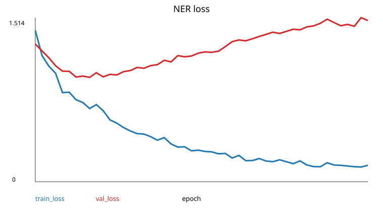
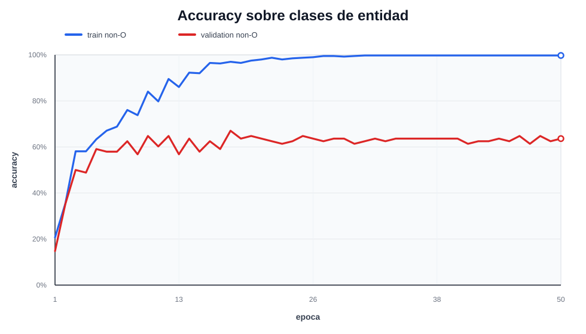
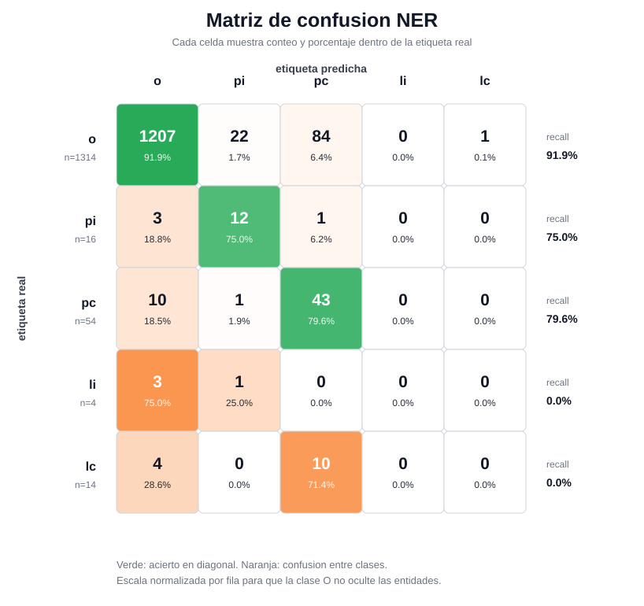

# Practica 5

## Exploracion de hiperparametros NER

La exploracion se centro en el ajuste fino de la cabeza NER. La arquitectura del
Transformer se mantuvo fija porque parte de `practica_5/pesos_modelo.pth`; cambiar
`d_model`, `n_heads`, `n_layers`, `dropout`, `context_size` o `expansion` haria que
los pesos preentrenados dejaran de ser compatibles.

El objetivo del grid no fue maximizar solo la accuracy total, sino encontrar un
equilibrio entre mantener bien clasificada la clase mayoritaria `o` y mejorar la
deteccion de entidades.

## Preparacion de datos

El corpus anotado se carga desde `pre-entrega_2601/merged.json`. Antes se partia
el dataset despues de aplicar BPE, lo que podia dejar trozos de una misma frase
en train y validacion. Se cambio a un split estratificado por frases completas:
primero se eligen frases para validacion intentando conservar la proporcion de
etiquetas y despues se aplica el alineamiento a BPE.

El split actual es aproximadamente 85/15:

| split | frases | chunks BPE | `o` | `pi` | `pc` | `li` | `lc` |
| --- | ---: | ---: | ---: | ---: | ---: | ---: | ---: |
| train | 50 | 85 | 7214 | 83 | 252 | 17 | 49 |
| validacion | 9 | 16 | 1314 | 16 | 54 | 4 | 14 |

La validacion sigue siendo pequena, especialmente para lugares (`li`, `lc`), pero
ya contiene mas ejemplos que el split 90/10 inicial.

## Espacio de busqueda

La arquitectura se dejo fija:

| parametro | valor |
| --- | ---: |
| `d_model` | 128 |
| `n_heads` | 4 |
| `n_layers` | 2 |
| `dropout` | 0.2 |
| `context_size` | 128 |
| `expansion` | 4 |

El grid se aplico a los parametros de fine-tuning:

| hiperparametro | valores probados |
| --- | --- |
| `batch_size` | 8, 16, 32, 64 |
| `lr` | 0.001, 0.0005, 0.0003, 0.0001, 0.00005 |
| `entity_loss_weight` | 3, 5, 7, 10, 15, 20, 25, 30 |
| `epochs` | 50 |

La loss pondera `o` con peso 1 y todas las clases de entidad con
`entity_loss_weight`. Esto evita que el modelo aprenda la solucion trivial de
predecir casi todo como `o`.

## Metrica de seleccion

Se uso:

```text
score = val_accuracy + 1.5 * val_non_o_accuracy
```

con filtro:

```text
si val_accuracy < 0.8, score = -1
```

`val_non_o_accuracy` mide los aciertos sobre tokens cuya etiqueta real no es `o`.
Es una metrica cercana al recall micro de entidades. Se mantiene `val_accuracy`
como filtro para evitar modelos que detecten entidades a costa de romper la clase
mayoritaria.

Durante cada entrenamiento se guarda internamente el mejor checkpoint segun ese
score; no se elige necesariamente la ultima epoca.

## Mejor configuracion

El mejor resultado del grid actual fue el `run 54`:

| parametro | valor |
| --- | ---: |
| `batch_size` | 16 |
| `lr` | 0.0005 |
| `entity_loss_weight` | 20 |
| mejor epoca | 49 |
| `val_loss` | 1.5144 |
| `val_accuracy` | 0.9001 |
| `val_non_o_accuracy` | 0.6250 |
| `val_macro_entity_f1` | 0.4547 |
| `selection_score` | 1.8376 |

El calculo del score es:

```text
0.9001 + 1.5 * 0.6250 = 1.8376
```

Los cinco mejores runs fueron:

| run | score | epoch | acc | non-O acc | macro entity F1 | batch | lr | entity weight |
| ---: | ---: | ---: | ---: | ---: | ---: | ---: | ---: | ---: |
| 54 | 1.8376 | 49 | 0.9001 | 0.6250 | 0.4547 | 16 | 0.0005 | 20 |
| 47 | 1.8309 | 22 | 0.8252 | 0.6705 | 0.3117 | 16 | 0.0010 | 25 |
| 55 | 1.8119 | 37 | 0.8573 | 0.6364 | 0.3613 | 16 | 0.0005 | 25 |
| 48 | 1.8070 | 30 | 0.8866 | 0.6136 | 0.3889 | 16 | 0.0010 | 30 |
| 93 | 1.8012 | 34 | 0.8466 | 0.6364 | 0.3327 | 32 | 0.0005 | 15 |

## Analisis del mejor modelo

La matriz de confusion del mejor modelo es:

| real \\ predicho | `o` | `pi` | `pc` | `li` | `lc` |
| --- | ---: | ---: | ---: | ---: | ---: |
| `o` | 1207 | 22 | 84 | 0 | 1 |
| `pi` | 3 | 12 | 1 | 0 | 0 |
| `pc` | 10 | 1 | 43 | 0 | 0 |
| `li` | 3 | 1 | 0 | 0 | 0 |
| `lc` | 4 | 0 | 10 | 0 | 0 |

Por etiqueta:

| etiqueta | precision | recall | F1 | soporte |
| --- | ---: | ---: | ---: | ---: |
| `o` | 0.9837 | 0.9186 | 0.9500 | 1314 |
| `pi` | 0.3333 | 0.7500 | 0.4615 | 16 |
| `pc` | 0.3116 | 0.7963 | 0.4479 | 54 |
| `li` | n/a | 0.0000 | n/a | 4 |
| `lc` | 0.0000 | 0.0000 | n/a | 14 |

El modelo aprende razonablemente las entidades de persona (`pi`, `pc`), pero no
aprende lugares. Esto es coherente con el corpus: hay muchos menos ejemplos de
lugares y, en validacion, las continuaciones de lugar (`lc`) se confunden sobre
todo con continuaciones de persona (`pc`).

## Figuras generadas

El grid guarda solo el mejor modelo y sus metricas:

```text
grid_ner/best_ner.pth
grid_ner/best_result.json
grid_ner/results.json
grid_ner/best_ner_metrics/
```

Figuras principales:








## Conclusiones

1. La accuracy total es insuficiente para evaluar NER en este corpus, porque la
   clase `o` domina claramente.
2. Aumentar el peso de las entidades en la loss mejora la recuperacion de tokens
   de entidad, pero tambien introduce falsos positivos sobre `o`.
3. Los mejores resultados aparecen con `batch_size=16`, learning rates medios
   (`0.001` o `0.0005`) y pesos de entidad entre 20 y 30.
4. La seleccion por mejor checkpoint es necesaria: la ultima epoca no siempre es
   la mejor en validacion.
5. El principal cuello de botella ya no es la arquitectura, sino la escasez y el
   desequilibrio de ejemplos de lugares. Para mejorar `li` y `lc` haria falta mas
   etiquetado o validacion cruzada para estimar mejor su rendimiento.
